# Zindi-Uber-Traffic-Jam-Competition

This repo contains my major learnings from participating in the Zindi Uber Traffic Jam Competition. It is specifically adapted for new data scientists.


### This notebook chronicles my major learnings from the Uber traffic prediction competition hosted on Zindi.

# Initial Preprocessing 

In this competition, the target value was not explicitly given in the training set so we needed to an initial preprocessing to obtain it. Special thanks to the community for providing us with the initial processing code. The code is replicated below.


```python
import numpy as np
import pandas as pd
import seaborn as sns
import matplotlib.pylab as plt
```


```python
uber = pd.read_csv('train_revised.csv', low_memory=False)
test = pd.read_csv('test_questions.csv', low_memory=False)
```


```python
uber.head()
```


<div>
<style scoped>
    .dataframe tbody tr th:only-of-type {
        vertical-align: middle;
    }

    .dataframe tbody tr th {
        vertical-align: top;
    }

    .dataframe thead th {
        text-align: right;
    }
</style>
<table border="1" class="dataframe">
  <thead>
    <tr style="text-align: right;">
      <th></th>
      <th>ride_id</th>
      <th>seat_number</th>
      <th>payment_method</th>
      <th>payment_receipt</th>
      <th>travel_date</th>
      <th>travel_time</th>
      <th>travel_from</th>
      <th>travel_to</th>
      <th>car_type</th>
      <th>max_capacity</th>
    </tr>
  </thead>
  <tbody>
    <tr>
      <th>0</th>
      <td>1442</td>
      <td>15A</td>
      <td>Mpesa</td>
      <td>UZUEHCBUSO</td>
      <td>17-10-17</td>
      <td>7:15</td>
      <td>Migori</td>
      <td>Nairobi</td>
      <td>Bus</td>
      <td>49</td>
    </tr>
    <tr>
      <th>1</th>
      <td>5437</td>
      <td>14A</td>
      <td>Mpesa</td>
      <td>TIHLBUSGTE</td>
      <td>19-11-17</td>
      <td>7:12</td>
      <td>Migori</td>
      <td>Nairobi</td>
      <td>Bus</td>
      <td>49</td>
    </tr>
    <tr>
      <th>2</th>
      <td>5710</td>
      <td>8B</td>
      <td>Mpesa</td>
      <td>EQX8Q5G19O</td>
      <td>26-11-17</td>
      <td>7:05</td>
      <td>Keroka</td>
      <td>Nairobi</td>
      <td>Bus</td>
      <td>49</td>
    </tr>
    <tr>
      <th>3</th>
      <td>5777</td>
      <td>19A</td>
      <td>Mpesa</td>
      <td>SGP18CL0ME</td>
      <td>27-11-17</td>
      <td>7:10</td>
      <td>Homa Bay</td>
      <td>Nairobi</td>
      <td>Bus</td>
      <td>49</td>
    </tr>
    <tr>
      <th>4</th>
      <td>5778</td>
      <td>11A</td>
      <td>Mpesa</td>
      <td>BM97HFRGL9</td>
      <td>27-11-17</td>
      <td>7:12</td>
      <td>Migori</td>
      <td>Nairobi</td>
      <td>Bus</td>
      <td>49</td>
    </tr>
  </tbody>
</table>
</div>


```python
ride_id_dict = {} 
for ride_id in uber["ride_id"]:
    if not ride_id in ride_id_dict:
        ride_id_dict[ride_id] = 1
    else:
        ride_id_dict[ride_id] += 1 
```


```python
uber = uber.drop(['seat_number', 'payment_method', 'payment_receipt', 'travel_to'], axis=1)
```


```python
uber.drop_duplicates(inplace=True)
uber.reset_index(drop= True, inplace=True)
```


```python
uber["number_of_tickets"]= np.zeros(len(uber))
```


```python
for i in range(len(uber)):
    ride_id = uber.loc[i]["ride_id"]
    uber.at[i,"number_of_tickets"] = ride_id_dict[ride_id]
```


```python
uber.head()
```


<div>
<style scoped>
    .dataframe tbody tr th:only-of-type {
        vertical-align: middle;
    }

    .dataframe tbody tr th {
        vertical-align: top;
    }

    .dataframe thead th {
        text-align: right;
    }
</style>
<table border="1" class="dataframe">
  <thead>
    <tr style="text-align: right;">
      <th></th>
      <th>ride_id</th>
      <th>travel_date</th>
      <th>travel_time</th>
      <th>travel_from</th>
      <th>car_type</th>
      <th>max_capacity</th>
      <th>number_of_tickets</th>
    </tr>
  </thead>
  <tbody>
    <tr>
      <th>0</th>
      <td>1442</td>
      <td>17-10-17</td>
      <td>7:15</td>
      <td>Migori</td>
      <td>Bus</td>
      <td>49</td>
      <td>1.0</td>
    </tr>
    <tr>
      <th>1</th>
      <td>5437</td>
      <td>19-11-17</td>
      <td>7:12</td>
      <td>Migori</td>
      <td>Bus</td>
      <td>49</td>
      <td>1.0</td>
    </tr>
    <tr>
      <th>2</th>
      <td>5710</td>
      <td>26-11-17</td>
      <td>7:05</td>
      <td>Keroka</td>
      <td>Bus</td>
      <td>49</td>
      <td>1.0</td>
    </tr>
    <tr>
      <th>3</th>
      <td>5777</td>
      <td>27-11-17</td>
      <td>7:10</td>
      <td>Homa Bay</td>
      <td>Bus</td>
      <td>49</td>
      <td>5.0</td>
    </tr>
    <tr>
      <th>4</th>
      <td>5778</td>
      <td>27-11-17</td>
      <td>7:12</td>
      <td>Migori</td>
      <td>Bus</td>
      <td>49</td>
      <td>31.0</td>
    </tr>
  </tbody>
</table>
</div>


# EXPLORATORY DATA ANALYSIS

In this step, we aim to understand the provided data to see if there are patterns, structures, etc. that could be useful in our modelling phase. 

N.B: There is another EDA provided through the community. You can also check it out in the Uber Discussion.


```python
uber.info()
```

    <class 'pandas.core.frame.DataFrame'>
    RangeIndex: 6249 entries, 0 to 6248
    Data columns (total 7 columns):
    ride_id              6249 non-null int64
    travel_date          6249 non-null object
    travel_time          6249 non-null object
    travel_from          6249 non-null object
    car_type             6249 non-null object
    max_capacity         6249 non-null int64
    number_of_tickets    6249 non-null float64
    dtypes: float64(1), int64(2), object(4)
    memory usage: 341.8+ KB
    


```python
test.info()
```

    <class 'pandas.core.frame.DataFrame'>
    RangeIndex: 1111 entries, 0 to 1110
    Data columns (total 7 columns):
    ride_id         1111 non-null int64
    travel_date     1111 non-null object
    travel_time     1111 non-null object
    travel_from     1111 non-null object
    travel_to       1111 non-null object
    car_type        1111 non-null object
    max_capacity    1111 non-null int64
    dtypes: int64(2), object(5)
    memory usage: 60.8+ KB
    

From the above codes, we can see that there are no null values meaning this dataset is 'super-clean'. This is not the usual scenerio. Data-cleaning is usually an important step developing a good model.

We can also see that our travel dates is treated as an object. We should reconsider changing it to datetype.


```python
uber['travel_date'] = pd.to_datetime(uber['travel_date'])
test['travel_date'] = pd.to_datetime(test['travel_date'])
```


```python
print(uber['travel_date'].dtypes)
print(test['travel_date'].dtypes)
```

    datetime64[ns]
    datetime64[ns]
    

Let us start our exploration proper.


```python
sns.barplot(x='car_type',y='max_capacity',data=uber)
```


    <matplotlib.axes._subplots.AxesSubplot at 0x20d6c93e2e8>


```python
sns.countplot(x='max_capacity',data=uber,hue='car_type')
```


    <matplotlib.axes._subplots.AxesSubplot at 0x20d6cee3f98>


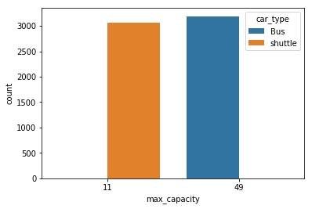


From the data description, we already know that all buses and shuttles have the same maximum capacity. That was easily confirmed using the seaborn barplot.

Another thing we explored was the numbers of buses and shuttles in the dataset using seaborn's countplot. We can see that they are rougly the same. 

We can confirmed if this holds true for the test set too


```python
sns.barplot(x='car_type',y='max_capacity',data=test)
```


    <matplotlib.axes._subplots.AxesSubplot at 0x20d6ca44400>


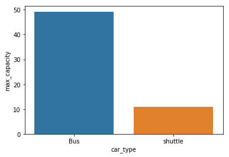


```python
sns.countplot(x='max_capacity',data=test,hue='car_type')
```


    <matplotlib.axes._subplots.AxesSubplot at 0x20d6cab2278>


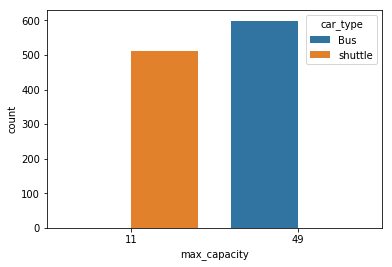


It can be seen that the training is fairly representative of the test set. This is important as we want our unseen scenerios to be similar to the seen scenerios to make our models as accurate as possible

Another thing that is worth exploring is the travel times. Are they horly in nature? Are they just morning journeys? etc. To do this, we have to convert the travel times to meaning numerical data. One way will be to just extract the hour term. Another way is to convert is to minutes from midnight (another valuable insight provided by the community).


```python
#Extracting the hour term
uber['hour_booked'] = pd.to_numeric(uber['travel_time'].str.extract(r'(^\d*)').loc[:,0])
test['hour_booked'] = pd.to_numeric(test['travel_time'].str.extract(r'(^\d*)').loc[:,0])
```


```python
uber['hour_booked'].value_counts().plot.bar()
```


    <matplotlib.axes._subplots.AxesSubplot at 0x20d6cab21d0>


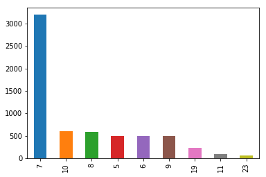


```python
test['hour_booked'].value_counts().plot.bar()
```


    <matplotlib.axes._subplots.AxesSubplot at 0x20d6cefccf8>


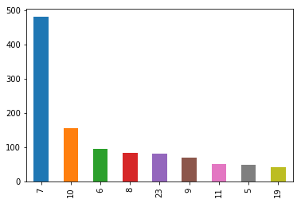


```python
#express travel time in minutes from midnight
test["travel_time"] = test["travel_time"].str.split(':').apply(lambda x: int(x[0]) * 60 + int(x[1]))
uber["travel_time"] = uber["travel_time"].str.split(':').apply(lambda x: int(x[0]) * 60 + int(x[1]))
```


```python
(uber["travel_time"]/60).plot.hist(bins=100)
```


    <matplotlib.axes._subplots.AxesSubplot at 0x20d6d1214a8>


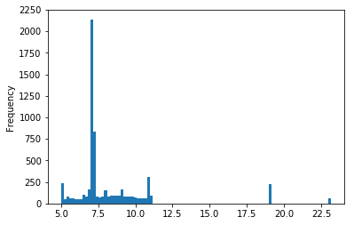


```python
(uber["travel_time"]/60).plot.hist(bins=100)
```


    <matplotlib.axes._subplots.AxesSubplot at 0x20d6d044c88>


```python
(test["travel_time"]/60).plot.hist(bins=100)
```


    <matplotlib.axes._subplots.AxesSubplot at 0x20d6d1b5f28>


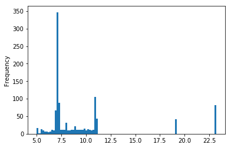


Both methods gave us almost the same information about the data. The most frequent travel time is around 7am and most of the journeys take place before noon with some journeys at 7pm and 11pm.

Another column to explore is travel from i.e where do most of our customers come from?


```python
uber['travel_from'].value_counts().plot.bar()
```


    <matplotlib.axes._subplots.AxesSubplot at 0x20d6d315d68>


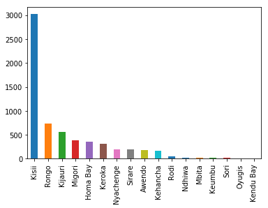


```python
test['travel_from'].value_counts().plot.bar()
```


    <matplotlib.axes._subplots.AxesSubplot at 0x20d6d446128>


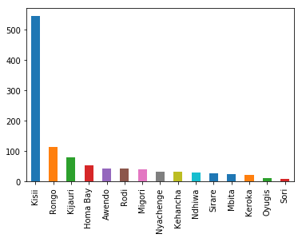


So many of our customers are actually coming from Kisii. The training set is fairly representative of the test set too.

We can also explore to see if people are likely to travel on a particular day of the week more than the rest.


```python
uber["travel_day"] = uber["travel_date"].dt.day_name()
test["travel_day"] = test["travel_date"].dt.day_name()
```


```python
uber["travel_yr"] = uber["travel_date"].dt.year
test["travel_yr"] = test["travel_date"].dt.year
```


```python
#Calculating the number of weeks in the dataset we have data for
a=uber[uber["travel_yr"]==2018]["travel_date"].dt.week.nunique() + uber[uber["travel_yr"]==2017]["travel_date"].dt.week.nunique()
b=test[test["travel_yr"]==2018]["travel_date"].dt.week.nunique() + test[test["travel_yr"]==2017]["travel_date"].dt.week.nunique()
```


```python
(uber[uber['car_type']=='shuttle']["travel_day"].value_counts()/a).plot.bar()
```


    <matplotlib.axes._subplots.AxesSubplot at 0x20d6d5880f0>


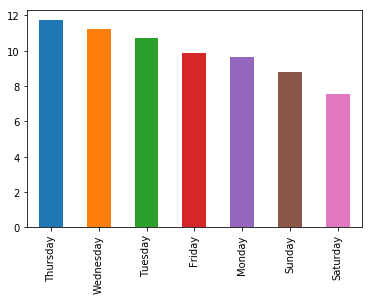


```python
(test[test['car_type']=='shuttle']["travel_day"].value_counts()/b).plot.bar()
```


    <matplotlib.axes._subplots.AxesSubplot at 0x20d6d58b5c0>


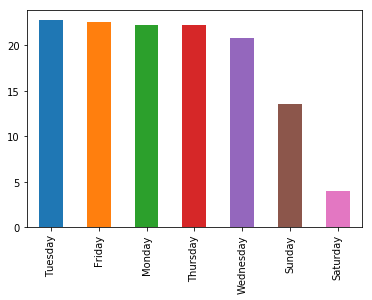


```python
(uber[uber['car_type']=='Bus']["travel_day"].value_counts()/a).plot.bar()
```


    <matplotlib.axes._subplots.AxesSubplot at 0x20d6d61b470>


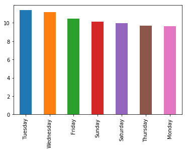


```python
(test[test['car_type']=='Bus']["travel_day"].value_counts()/b).plot.bar()
```


    <matplotlib.axes._subplots.AxesSubplot at 0x20d6d643e10>


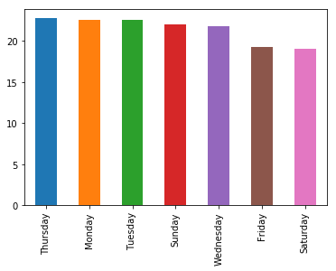


```python
(uber["travel_day"].value_counts()/a).plot.bar()
```


    <matplotlib.axes._subplots.AxesSubplot at 0x20d6d68f5c0>


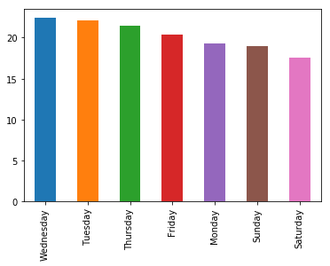


```python
(test["travel_day"].value_counts()/b).plot.bar()
```


    <matplotlib.axes._subplots.AxesSubplot at 0x20d6d753748>


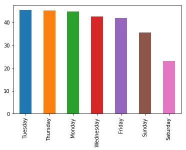


From the above analysis, there seem to be no clear indication that the day of the week matters as the average people that travel on a particular day seems to change with context.


```python
uber[uber["travel_yr"]==2017]["travel_date"].dt.month.value_counts().sort_index().plot.bar()
```


    <matplotlib.axes._subplots.AxesSubplot at 0x20d6d7c01d0>


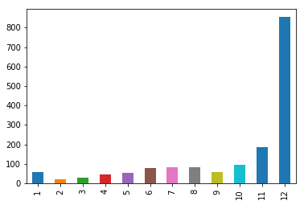


```python
uber[uber["travel_yr"]==2018]["travel_date"].dt.month.value_counts().sort_index().plot.bar()
```


    <matplotlib.axes._subplots.AxesSubplot at 0x20d6d77eeb8>


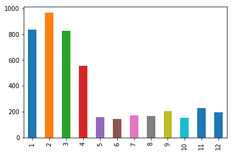


```python
try:
    test[test["travel_yr"]==2017]["travel_date"].dt.month.value_counts().sort_index().plot.bar()
except:
    print('No data point to plot.')
```

    No data point to plot.
    


```python
test[test["travel_yr"]==2018]["travel_date"].dt.month.value_counts().sort_index().plot.bar()
```


    <matplotlib.axes._subplots.AxesSubplot at 0x20d6d84afd0>


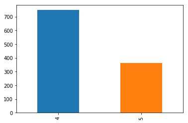


It is clear that from the exploration above that there is something inconsistent about the travel date in the training set. There shouldn't be data for anytime earlier time earlier than Oct 2017 and later than April 2018. This make the date an unreliable indicator. Thus, any date-related feature is unnecessary for modelling.

Lastly we can check to see the distribution for ticket sales.


```python
((uber[uber['car_type']=='Bus']['number_of_tickets'])).plot.density()
```


    <matplotlib.axes._subplots.AxesSubplot at 0x20d6d4e34e0>


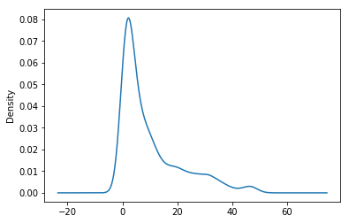


```python
((uber[uber['car_type']=='shuttle']['number_of_tickets'])).plot.density()
```


    <matplotlib.axes._subplots.AxesSubplot at 0x20d6d9182b0>


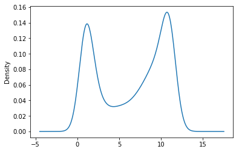


It can be seen that for buses, the bus is usually almost empty while for the shuttles, they are almost always full or empty.


```python
uber = uber[['travel_time','travel_from','car_type','number_of_tickets','hour_booked']]
uber.head()
```


<div>
<style scoped>
    .dataframe tbody tr th:only-of-type {
        vertical-align: middle;
    }

    .dataframe tbody tr th {
        vertical-align: top;
    }

    .dataframe thead th {
        text-align: right;
    }
</style>
<table border="1" class="dataframe">
  <thead>
    <tr style="text-align: right;">
      <th></th>
      <th>travel_time</th>
      <th>travel_from</th>
      <th>car_type</th>
      <th>number_of_tickets</th>
      <th>hour_booked</th>
    </tr>
  </thead>
  <tbody>
    <tr>
      <th>0</th>
      <td>435</td>
      <td>Migori</td>
      <td>Bus</td>
      <td>1.0</td>
      <td>7</td>
    </tr>
    <tr>
      <th>1</th>
      <td>432</td>
      <td>Migori</td>
      <td>Bus</td>
      <td>1.0</td>
      <td>7</td>
    </tr>
    <tr>
      <th>2</th>
      <td>425</td>
      <td>Keroka</td>
      <td>Bus</td>
      <td>1.0</td>
      <td>7</td>
    </tr>
    <tr>
      <th>3</th>
      <td>430</td>
      <td>Homa Bay</td>
      <td>Bus</td>
      <td>5.0</td>
      <td>7</td>
    </tr>
    <tr>
      <th>4</th>
      <td>432</td>
      <td>Migori</td>
      <td>Bus</td>
      <td>31.0</td>
      <td>7</td>
    </tr>
  </tbody>
</table>
</div>


# Feature Engineering


```python
#Trying to linearize the travel time feature for better prediction
uber['travel_time_log']=np.log(uber['travel_time'])
test['travel_time_log']=np.log(test['travel_time'])
```

We proceed to create two features: late night and early morning based on our EDA.


```python
uber['early_morning']=uber['hour_booked']<8
test['early_morning']=test['hour_booked']<8
uber['late_night']=uber['hour_booked']>18
test['late_night']=test['hour_booked']>18
```

We use the uber .corr function and seaborn's heatmap to see if there is any linear relationships between our features and targets


```python
sns.heatmap(abs(uber.corr()))
```


    <matplotlib.axes._subplots.AxesSubplot at 0x20d6d5711d0>


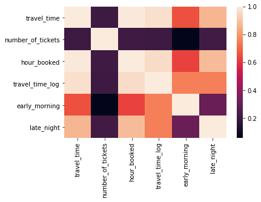


There seem to be no strong relationship between all of our features and target.

We now try to incoporate an external data - distance from town to Nairobi.


```python
distance={'Migori':370.9,'Keroka':279.8,'Kisii':305.5,'Homa Bay':305.5,'Keumbu':294.0,
        'Rongo':330.3,'Kijauri':276.6,'Oyugis':331.1,'Awendo':349.5,
        'Sirare':391.9,'Nyachenge':322.8,'Kehancha':377.5,
        'Kendu Bay':367.5,'Sori':392,'Rodi':349.1,'Mbita':399.4,
        'Ndhiwa':369.6}
```


```python
uber['distance']=uber['travel_from'].map({k:v for k,v in distance.items()})
test['distance']=test['travel_from'].map({k:v for k,v in distance.items()})
```


```python
test=pd.get_dummies(test,prefix=['car_type','travel_from'],columns=['car_type','travel_from'])
uber=pd.get_dummies(uber,prefix=['car_type','travel_from'],columns=['car_type','travel_from'])
```

# MODELLING


```python
print("Original features:\n", (list(uber.columns)), "\n")
```

    Original features:
     ['travel_time', 'number_of_tickets', 'hour_booked', 'travel_time_log', 'early_morning', 'late_night', 'distance', 'car_type_Bus', 'car_type_shuttle', 'travel_from_Awendo', 'travel_from_Homa Bay', 'travel_from_Kehancha', 'travel_from_Kendu Bay', 'travel_from_Keroka', 'travel_from_Keumbu', 'travel_from_Kijauri', 'travel_from_Kisii', 'travel_from_Mbita', 'travel_from_Migori', 'travel_from_Ndhiwa', 'travel_from_Nyachenge', 'travel_from_Oyugis', 'travel_from_Rodi', 'travel_from_Rongo', 'travel_from_Sirare', 'travel_from_Sori'] 
    
    


```python
feature_cols=['travel_time', 'hour_booked', 'travel_time_log', 'early_morning', 'late_night', 'distance', 
         'car_type_Bus', 'car_type_shuttle', 'travel_from_Awendo', 'travel_from_Homa Bay', 'travel_from_Kehancha',
         'travel_from_Kendu Bay', 'travel_from_Keroka', 'travel_from_Keumbu', 'travel_from_Kijauri', 
         'travel_from_Kisii', 'travel_from_Mbita', 'travel_from_Migori', 'travel_from_Ndhiwa', 'travel_from_Nyachenge',
         'travel_from_Oyugis', 'travel_from_Rodi', 'travel_from_Rongo', 'travel_from_Sirare', 'travel_from_Sori']
```


```python
predicted_col=['number_of_tickets']
```


```python
X_train=uber[feature_cols].values
Y_train=uber[predicted_col].values

#Reshaping target column to avoid Sklearb throwing in a warning 
Y_train=Y_train.ravel()

split_test_size=0.30

from sklearn.model_selection import train_test_split
Xtrain, Xtest, Ytrain, Ytest= train_test_split(X_train,Y_train, test_size=split_test_size, random_state=260)
```


```python
from sklearn.metrics import mean_squared_error,mean_absolute_error
from sklearn.model_selection import cross_val_score,KFold,StratifiedKFold
kfold=KFold(n_splits=5)
from sklearn.preprocessing import PolynomialFeatures,MinMaxScaler,StandardScaler
poly=PolynomialFeatures(degree=1).fit(Xtrain)
```


```python
from sklearn.ensemble import GradientBoostingRegressor
from sklearn.ensemble import RandomForestRegressor
from sklearn.tree import DecisionTreeRegressor
from sklearn.linear_model import LinearRegression
```


```python
Utrain=(poly.transform(Xtrain))
Utest=(poly.transform(Xtest))
scaler=StandardScaler().fit(Utrain)
Utrain=scaler.transform(Utrain)
Utest=scaler.transform(Utest)
```

# First Model


```python
gbrt = GradientBoostingRegressor(criterion='mse',random_state=10,n_estimators=100).fit(Utrain,Ytrain)
cv = cross_val_score (gbrt,Utrain,Ytrain,cv=5)
print(" Average CV is: ", cv.mean())
Ypred=gbrt.predict(Utest)
MAE=mean_absolute_error(Ytest,Ypred)
MSE=mean_squared_error(Ytest,Ypred)
print("GBR MAE:", MAE)
print("GBR Training set score: {:.5f}".format(gbrt.score(Utrain,Ytrain)))
print("GBR Test set score: {:.5f}".format(gbrt.score(Utest,Ytest)))
```

     Average CV is:  0.5413819387042605
    GBR MAE: 3.9239083074393744
    GBR Training set score: 0.56234
    GBR Test set score: 0.54731
    


```python
b=list(gbrt.feature_importances_[1:])
pd.DataFrame(index=feature_cols,data=b).plot.bar()
```


    <matplotlib.axes._subplots.AxesSubplot at 0x20d6e2f74e0>


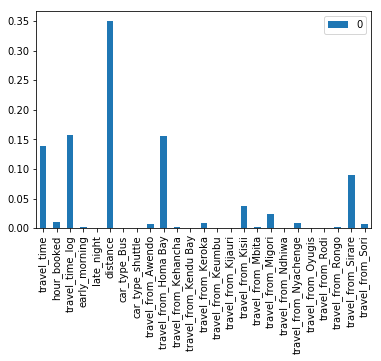


We can clearly see that some features are far more important than some others. While we can just minually remove them. It is better we use the sklearn.feature_selection recursive feature selection with or without cross validation tool (it is better with cv).


```python
from sklearn.feature_selection import SelectFromModel
from sklearn.feature_selection import RFE,RFECV
select = RFECV(gbrt,cv=5)
select.fit(Utrain,Ytrain)
```


    RFECV(cv=5,
       estimator=GradientBoostingRegressor(alpha=0.9, criterion='mse', init=None,
                 learning_rate=0.1, loss='ls', max_depth=3, max_features=None,
                 max_leaf_nodes=None, min_impurity_decrease=0.0,
                 min_impurity_split=None, min_samples_leaf=1,
                 min_samples_split=...te=10, subsample=1.0, tol=0.0001,
                 validation_fraction=0.1, verbose=0, warm_start=False),
       min_features_to_select=1, n_jobs=None, scoring=None, step=1, verbose=0)


```python
select.n_features_
```


    13


We see that the feature selection tool reduced the features from about 25 to 13


```python
cv = cross_val_score (select,Utrain,Ytrain,cv=5)
print(" Average CV is: ", cv.mean())
Ypred=select.predict(Utest)
MAE=mean_absolute_error(Ytest,Ypred)
print("GBR MAE:", MAE)
print("GBR Training set score: {:.5f}".format(select.score(Utrain,Ytrain)))
print("GBR Test set score: {:.5f}".format(select.score(Utest,Ytest)))
```

     Average CV is:  0.5434639649815292
    GBR MAE: 3.9347467695573606
    GBR Training set score: 0.56809
    GBR Test set score: 0.54587
    

It can be seen that the metrics are almost the same for both sets of features but we prefer the select model because according to Ockham razor principle, you always want to the simplest model that performs best.


# Other implementation

While I tried out other implementations like xgboost, Adaboost, Light GBM, Decision trees, Extra trees and Random Forest, I didnt pay much attention to them as I started the challenge late and didnt have the time to tune every model. I also tried out tricks like PCA but the results were not better off than using just select.I focused only on Gradient Boosting. In hindsight, that may not have been the best decision.

I will however be sharing one other implementation I tried out with alongside gradient boosting (after heavy parameter tuning using Grid Search). Because of the time it took to grid-search, I will just be implementing the best model I obtained in my first grid-search range. To learn more about Grid Search ()


```python
gbr = GradientBoostingRegressor(learning_rate=.3,random_state=100,n_estimators=220,subsample=0.75,
                                loss='lad').fit(Utrain,Ytrain)
select2 = RFECV(gbr,cv=5)
select2.fit(Utrain,Ytrain)
```


    RFECV(cv=5,
       estimator=GradientBoostingRegressor(alpha=0.9, criterion='friedman_mse', init=None,
                 learning_rate=0.3, loss='lad', max_depth=3, max_features=None,
                 max_leaf_nodes=None, min_impurity_decrease=0.0,
                 min_impurity_split=None, min_samples_leaf=1,
                 min_samp...=100, subsample=0.75, tol=0.0001,
                 validation_fraction=0.1, verbose=0, warm_start=False),
       min_features_to_select=1, n_jobs=None, scoring=None, step=1, verbose=0)


```python
cv = cross_val_score (select2,Utrain,Ytrain,cv=5)
print(" Average CV is: ", cv.mean())
Ypred=select2.predict(Utest)
MAE=mean_absolute_error(Ytest,Ypred)
print("GBR MAE:", MAE)
print("GBR Training set score: {:.5f}".format(select2.score(Utrain,Ytrain)))
print("GBR Test set score: {:.5f}".format(select2.score(Utest,Ytest)))
```

     Average CV is:  0.5159643614441931
    GBR MAE: 3.53976801371126
    GBR Training set score: 0.54808
    GBR Test set score: 0.53017
    


```python
import mlxtend
```


```python
#You will need to install mlxtend 
from mlxtend.regressor import StackingCVRegressor
```

Since we cant use the stackingCVRegressor with the RFECV select model, we need to redefine our inputs such that the only the most informative features are used. (There is a slight increase from 13 - 19) because I choose to include all the categories of the travel_from. 


```python
feature_cols=['travel_time_log', 'travel_from_Awendo', 'distance','car_type_shuttle',
                   'travel_from_Homa Bay', 'travel_from_Kehancha', 'travel_from_Kendu Bay', 'travel_from_Keroka', 
                   'travel_from_Keumbu', 'travel_from_Kijauri', 'travel_from_Kisii', 'travel_from_Mbita', 'travel_from_Migori', 
                   'travel_from_Ndhiwa', 'travel_from_Nyachenge', 'travel_from_Rodi', 
                   'travel_from_Rongo', 'travel_from_Sirare', 'travel_from_Sori']
```


```python
predicted_col=['number_of_tickets']
```


```python
X_train=uber[feature_cols].values
Y_train=uber[predicted_col].values

Y_train=Y_train.ravel()

split_test_size=0.3

from sklearn.model_selection import train_test_split
Xtrain, Xtest, Ytrain, Ytest= train_test_split(X_train,Y_train, test_size=split_test_size, random_state=260)
```

Stacking is a type of ensembling that combines the results of two or more estimators using another estimator. Please note that my implementation may not be the best. Stacking is supposed to be used when you are trying to merge the results of three very good estimators. I didn't optimize the decision tree and random forest models.

However, it can be seen that stacked model is not so far off from my best model (imagine the potential if I had used it on many highly tuned models).


```python
lr=LinearRegression()
dt = DecisionTreeRegressor(criterion='mae',random_state=100)
rf = RandomForestRegressor(random_state=10,n_estimators=100)
gb = GradientBoostingRegressor(learning_rate=.3,random_state=100,n_estimators=220,subsample=0.75,
                               loss='lad')
stack = StackingCVRegressor(regressors=(gb, dt, rf),
                            meta_regressor=lr,cv=5)
stack.fit(Utrain,Ytrain)
```


    StackingCVRegressor(cv=5,
              meta_regressor=LinearRegression(copy_X=True, fit_intercept=True, n_jobs=None,
             normalize=False),
              refit=True,
              regressors=(GradientBoostingRegressor(alpha=0.9, criterion='friedman_mse', init=None,
                 learning_rate=0.3, loss='lad', max_depth=3, max_features=None,
                 max_leaf_nodes=None, min_impurity_decrease=0.0,
                 min_impurity_split=None, min_samples_leaf=1,
                 min_sa...imators=100, n_jobs=None,
               oob_score=False, random_state=10, verbose=0, warm_start=False)),
              shuffle=True, store_train_meta_features=False,
              use_features_in_secondary=False)


Below I will be slightly changing my implementation. I am using the mean_absolute_error as the scorer so I can easily see whether my model is generalizing well since mae is the objective metric is the challenge.


```python
from sklearn.metrics import make_scorer
```


```python
cv = cross_val_score (stack,Utrain,Ytrain,cv=5,scoring=make_scorer(mean_absolute_error))
print("Average CV is:", round(cv.mean(),3),cv.std())
Ypred=stack.predict(Utest)
Ypred_t=stack.predict(Utrain)
MAE=mean_absolute_error(Ytest,Ypred)
MAE_t=mean_absolute_error(Ytrain,Ypred_t)
print("GBR Training set score: {:.3f}".format(MAE_t))
print("GBR Test set score: {:.3f}".format(MAE))
```

    Average CV is: 3.757 0.20927656236807862
    GBR Training set score: 3.604
    GBR Test set score: 3.742
    

After another set of gridsearch (ran for about five hours), my winning I came up with my best solution which ended out in the top 25% of all the submitted entries. My model ended up about 0.5 MAE behind winning model in the public leaderboard. I ran out of time to try out other grid search parameters unfortunately.

Below I will contrasting my model to a model of a friend that ended in the top 5% of all submitted entries (about 0.2 MAE behind the winning model).


```python
gb=GradientBoostingRegressor(learning_rate=.5,random_state=100,n_estimators=250,subsample=0.75,loss='lad',
                            max_depth=4).fit(Xtrain,Ytrain)
cv = cross_val_score (gb,Utrain,Ytrain,cv=5,scoring=make_scorer(mean_absolute_error))
print("Average CV is:", round(cv.mean(),3),cv.std())
Ypred=gb.predict(Xtest)
Ypred_t=gb.predict(Xtrain)
MAE=mean_absolute_error(Ytest,Ypred)
MAE_t=mean_absolute_error(Ytrain,Ypred_t)
print("GBR Training set score: {:.3f}".format(MAE_t))
print("GBR Test set score: {:.3f}".format(MAE))
```

    Average CV is: 3.617 0.2584669864383674
    GBR Training set score: 3.425
    GBR Test set score: 3.512
    

The major difference between the two implementation is the range of Grid Search. While I constrained myself, his grid search was more extensive but it took about 3 days for these parameters to be obtained. His implementation is available in the folder. 

Finally, I will be sharing something I learnt from a friend after I shared this concern with him after the competition ended: Randomized Search. Randomized Search is similar to Grid Search. The only difference is not available permutations are tested. It randomly picks a specified amount of permutations as defined by you. This could save you a lot of time and helps you choose a more extensive range of search parameters. 


```python
from sklearn.model_selection import RandomizedSearchCV
```


```python
#There are about 300,000 different combinations in the grid defined below. We would be using random search to pick just ten
#and see how our model fairs (we do tgis using n_iter)

estimator = GradientBoostingRegressor(random_state=12)
param = {'learning_rate':[0.001, 0.003,.01,0.03,0.05,0.1,0.3,0.5,1,3,5 ],
        'n_estimators':[i for i in range(50,550,10)],
        'subsample':[i/100 for i in range(50,100,5)],
        'loss':['lad','ls','huber'],
        'max_depth':[i for i in range(1,20)]}
rs=RandomizedSearchCV(estimator, param_distributions = param, 
                      n_iter=10, n_jobs=-1, random_state=81,cv=3,
                     return_train_score=True)
rs.fit(Xtrain,Ytrain)
```

    C:\Users\ADEBAYO\Anaconda3\lib\site-packages\sklearn\model_selection\_search.py:791: RuntimeWarning: overflow encountered in square
      array_means[:, np.newaxis]) ** 2,
    


    RandomizedSearchCV(cv=3, error_score='raise-deprecating',
              estimator=GradientBoostingRegressor(alpha=0.9, criterion='friedman_mse', init=None,
                 learning_rate=0.1, loss='ls', max_depth=3, max_features=None,
                 max_leaf_nodes=None, min_impurity_decrease=0.0,
                 min_impurity_split=None, min_samples_leaf=1,
                 min_sampl...te=12, subsample=1.0, tol=0.0001,
                 validation_fraction=0.1, verbose=0, warm_start=False),
              fit_params=None, iid='warn', n_iter=10, n_jobs=-1,
              param_distributions={'learning_rate': [0.001, 0.003, 0.01, 0.03, 0.05, 0.1, 0.3, 0.5, 1, 3, 5], 'n_estimators': [50, 60, 70, 80, 90, 100, 110, 120, 130, 140, 150, 160, 170, 180, 190, 200, 210, 220, 230, 240, 250, 260, 270, 280, 290, 300, 310, 320, 330, 340, 350, 360, 370, 380, 390, 400, 410, 420, 43...', 'ls', 'huber'], 'max_depth': [1, 2, 3, 4, 5, 6, 7, 8, 9, 10, 11, 12, 13, 14, 15, 16, 17, 18, 19]},
              pre_dispatch='2*n_jobs', random_state=81, refit=True,
              return_train_score=True, scoring=None, verbose=0)


```python
a=pd.DataFrame(rs.cv_results_)
a.sort_values('rank_test_score').head().transpose()
```


<div>
<style scoped>
    .dataframe tbody tr th:only-of-type {
        vertical-align: middle;
    }

    .dataframe tbody tr th {
        vertical-align: top;
    }

    .dataframe thead th {
        text-align: right;
    }
</style>
<table border="1" class="dataframe">
  <thead>
    <tr style="text-align: right;">
      <th></th>
      <th>8</th>
      <th>1</th>
      <th>2</th>
      <th>4</th>
      <th>9</th>
    </tr>
  </thead>
  <tbody>
    <tr>
      <th>mean_fit_time</th>
      <td>9.46327</td>
      <td>18.5958</td>
      <td>4.23771</td>
      <td>20.7244</td>
      <td>0.421857</td>
    </tr>
    <tr>
      <th>std_fit_time</th>
      <td>0.454136</td>
      <td>0.103495</td>
      <td>0.241539</td>
      <td>0.899712</td>
      <td>0.0127586</td>
    </tr>
    <tr>
      <th>mean_score_time</th>
      <td>0.046871</td>
      <td>0.0520789</td>
      <td>0.0260406</td>
      <td>0.0572892</td>
      <td>0.00520714</td>
    </tr>
    <tr>
      <th>std_score_time</th>
      <td>0.022094</td>
      <td>0.0073653</td>
      <td>0.00736547</td>
      <td>0.00736648</td>
      <td>0.00736401</td>
    </tr>
    <tr>
      <th>param_subsample</th>
      <td>0.75</td>
      <td>0.5</td>
      <td>0.6</td>
      <td>0.65</td>
      <td>0.5</td>
    </tr>
    <tr>
      <th>param_n_estimators</th>
      <td>330</td>
      <td>230</td>
      <td>350</td>
      <td>450</td>
      <td>100</td>
    </tr>
    <tr>
      <th>param_max_depth</th>
      <td>7</td>
      <td>18</td>
      <td>4</td>
      <td>10</td>
      <td>1</td>
    </tr>
    <tr>
      <th>param_loss</th>
      <td>lad</td>
      <td>lad</td>
      <td>lad</td>
      <td>lad</td>
      <td>lad</td>
    </tr>
    <tr>
      <th>param_learning_rate</th>
      <td>0.01</td>
      <td>0.05</td>
      <td>0.1</td>
      <td>0.1</td>
      <td>0.3</td>
    </tr>
    <tr>
      <th>params</th>
      <td>{'subsample': 0.75, 'n_estimators': 330, 'max_...</td>
      <td>{'subsample': 0.5, 'n_estimators': 230, 'max_d...</td>
      <td>{'subsample': 0.6, 'n_estimators': 350, 'max_d...</td>
      <td>{'subsample': 0.65, 'n_estimators': 450, 'max_...</td>
      <td>{'subsample': 0.5, 'n_estimators': 100, 'max_d...</td>
    </tr>
    <tr>
      <th>split0_test_score</th>
      <td>0.582917</td>
      <td>0.584482</td>
      <td>0.583257</td>
      <td>0.581858</td>
      <td>0.383814</td>
    </tr>
    <tr>
      <th>split1_test_score</th>
      <td>0.518422</td>
      <td>0.518844</td>
      <td>0.51689</td>
      <td>0.516053</td>
      <td>0.358329</td>
    </tr>
    <tr>
      <th>split2_test_score</th>
      <td>0.481112</td>
      <td>0.468336</td>
      <td>0.463358</td>
      <td>0.457859</td>
      <td>0.330896</td>
    </tr>
    <tr>
      <th>mean_test_score</th>
      <td>0.527484</td>
      <td>0.523888</td>
      <td>0.521168</td>
      <td>0.51859</td>
      <td>0.35768</td>
    </tr>
    <tr>
      <th>std_test_score</th>
      <td>0.042053</td>
      <td>0.0475503</td>
      <td>0.0490421</td>
      <td>0.0506545</td>
      <td>0.0216084</td>
    </tr>
    <tr>
      <th>rank_test_score</th>
      <td>1</td>
      <td>2</td>
      <td>3</td>
      <td>4</td>
      <td>5</td>
    </tr>
    <tr>
      <th>split0_train_score</th>
      <td>0.532657</td>
      <td>0.548755</td>
      <td>0.532041</td>
      <td>0.546197</td>
      <td>0.36262</td>
    </tr>
    <tr>
      <th>split1_train_score</th>
      <td>0.562201</td>
      <td>0.576943</td>
      <td>0.566888</td>
      <td>0.572449</td>
      <td>0.382529</td>
    </tr>
    <tr>
      <th>split2_train_score</th>
      <td>0.571901</td>
      <td>0.586415</td>
      <td>0.569794</td>
      <td>0.579995</td>
      <td>0.386988</td>
    </tr>
    <tr>
      <th>mean_train_score</th>
      <td>0.555587</td>
      <td>0.570704</td>
      <td>0.556241</td>
      <td>0.566214</td>
      <td>0.377379</td>
    </tr>
    <tr>
      <th>std_train_score</th>
      <td>0.0166902</td>
      <td>0.0159952</td>
      <td>0.017153</td>
      <td>0.0144853</td>
      <td>0.0105941</td>
    </tr>
  </tbody>
</table>
</div>


```python
cv = cross_val_score (rs,Utrain,Ytrain,cv=5,scoring=make_scorer(mean_absolute_error))
print("Average CV is:", round(cv.mean(),3),cv.std())
Ypred=rs.predict(Xtest)
Ypred_t=rs.predict(Xtrain)
MAE=mean_absolute_error(Ytest,Ypred)
MAE_t=mean_absolute_error(Ytrain,Ypred_t)
print("GBR Training set score: {:.3f}".format(MAE_t))
print("GBR Test set score: {:.3f}".format(MAE))
```

    C:\Users\ADEBAYO\Anaconda3\lib\site-packages\sklearn\model_selection\_search.py:841: DeprecationWarning: The default of the `iid` parameter will change from True to False in version 0.22 and will be removed in 0.24. This will change numeric results when test-set sizes are unequal.
      DeprecationWarning)
    C:\Users\ADEBAYO\Anaconda3\lib\site-packages\sklearn\model_selection\_search.py:791: RuntimeWarning: overflow encountered in square
      array_means[:, np.newaxis]) ** 2,
    C:\Users\ADEBAYO\Anaconda3\lib\site-packages\sklearn\model_selection\_search.py:841: DeprecationWarning: The default of the `iid` parameter will change from True to False in version 0.22 and will be removed in 0.24. This will change numeric results when test-set sizes are unequal.
      DeprecationWarning)
    C:\Users\ADEBAYO\Anaconda3\lib\site-packages\sklearn\model_selection\_search.py:791: RuntimeWarning: overflow encountered in square
      array_means[:, np.newaxis]) ** 2,
    

It can be seen that while the implementation above is somewhat simple and time-efficient. The metrics are not particularly bad. One can rerun the search a few number of times and see whether there is a trend in the chosen parameter and then grid search based on the smaller range. One could also random search for a larger number of times.

# Conclusion

I heard that a top 5 model used Genetic Algorithm for its parameter tuning. Apparently, the person had a lot of time for the tuning as GA is very time-consuming like Grid Search. This may not be possible in a short hackathons or even in some real life scenerios where time is severly limited.

This notebook have taken us through some very important concepts in data science (EDA, Feature Selection, Stacking, HypperParameter Tuning) using the uber data from Zindi. It is specifically desined for those who are just starting their data science journey especially as regards working with real-life data. I hope you find it informative.

P.S: Any other top solution could just clone this notebook and mention one or two two things that made their model stand out if they dont have the time to share an extensive notebook like this. 


```python

```

